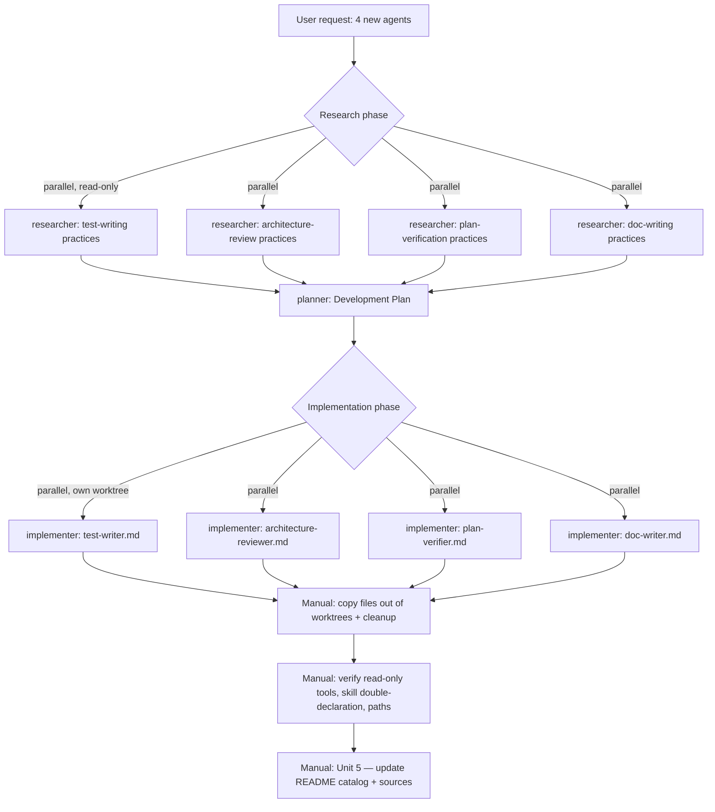
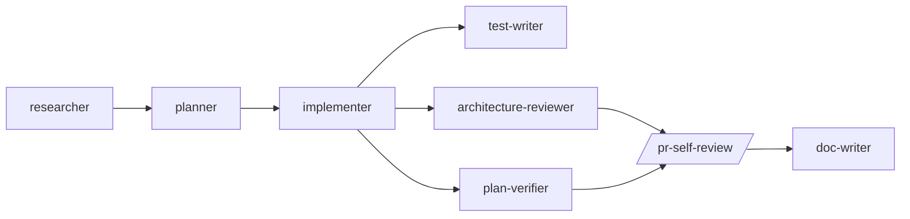

# Plan: Four new subagents (test-writer, architecture-reviewer, plan-verifier, doc-writer)

**Status:** Implemented · 2026-06-29
**Type (Diátaxis):** Explanation + Reference — a record of how this change was researched, planned, and built, plus the Development Plan it was built from.
**Scope:** Authoring four new Claude Code subagent definition files under `.claude/agents/` and updating `.claude/agents/README.md`. No application code (`server/`, `client/`, `reviewer-core/`) was touched.

---

## 1. Goal

Add four new subagents to the DevDigest agent suite, each **based on the repo's existing skills** and matching the conventions of the existing agents (`planner`, `implementer`, `researcher`):

| Agent | Write access | Model | Purpose |
|---|---|---|---|
| `test-writer` | Yes — test files only | sonnet | Writes tests for both UI (Vitest + RTL) and backend (Fastify `app.inject()` + Drizzle), grounded in repo skills + `TESTING.md`. |
| `architecture-reviewer` | No — read-only | opus | Single-shot, whole-tree architectural review (layering, isolation, cyclic deps). |
| `plan-verifier` | No — read-only | opus | Verifies a Development Plan against the written code — requirement coverage / traceability. |
| `doc-writer` | Yes — doc files only | sonnet | Documents shipped functionality, converts plans into ADRs/how-tos, produces docs with Mermaid diagrams. |

---

## 2. Process overview

The work followed the repo's intended agent flow — **researcher → planner → implementer** — extended with a manual integration + documentation step.

---

## 3. Research phase

Four `researcher` agents ran **in parallel** (read-only, internet + codebase), one per planned agent. Each returned a source-grounded report distinguishing firsthand-fetched pages from search snippets.

Key findings baked into the agent designs:

- **Test Writer** — integrity guardrails are the core value: never weaken / `.skip` / delete a failing test to force a pass; no tautological tests (asserting current output as expected); investigate both test and implementation on failure. Backend uses `app.inject()` + `MockLLMProvider`; frontend uses RTL query priority + `fetch` mocking (the repo convention per `TESTING.md`).
- **Architecture Reviewer** — whole-tree (not diff) scope; single-shot pass beats reflexion loops for signal-to-noise; ≤~10 force-ranked findings; no finding without `file:line` + the exact offending import; exclude `vendor/**`.
- **Plan Verifier** — enumerate every requirement atomically *before* opening code; per-item `met`/`partially_met`/`not_met`/`cannot_verify` with `file:line` evidence + confidence gate; grep for incompleteness markers; separation principle ("no stake in it passing").
- **Doc Writer** — classify via Diátaxis before writing; docs-as-code locations; Mermaid type per concept; anti-hallucination (read before writing, cite `path:line`, no invented examples, declare files read).

Sources per agent are catalogued in `.claude/agents/README.md` (design & sources sections).

---

## 4. Planning phase

The `planner` agent produced a Development Plan with five work units, parallel-safe via disjoint file ownership. It verified every cited path against the repo first (and corrected one assumption: client tests are **co-located** `*.test.tsx`, not in a separate folder, and the primary network-mocking convention is `fetch`-mocking, not MSW).

### Work units

| Unit | Owns | Layer |
|---|---|---|
| Unit 1 | `.claude/agents/test-writer.md` | meta / agent-authoring |
| Unit 2 | `.claude/agents/architecture-reviewer.md` | meta / agent-authoring |
| Unit 3 | `.claude/agents/plan-verifier.md` | meta / agent-authoring |
| Unit 4 | `.claude/agents/doc-writer.md` | meta / agent-authoring |
| Unit 5 | `.claude/agents/README.md` (edit) | docs — runs **after** 1–4 |

Each of Units 1–4 specified the exact frontmatter (`name`, `description`, `tools`, `model`, `skills`), the body outline, the research-backed rules to bake in, and "Done when" acceptance criteria. The house convention — **declare each skill in both the `skills:` frontmatter and the body** — was a required criterion for every unit.

### Execution order

- **Parallel:** Units 1, 2, 3, 4 (disjoint, one new file each).
- **Then serial:** Unit 5 (README) — depends on the four agents' final names/descriptions.

---

## 5. Implementation phase

Units 1–4 were executed by **four parallel `implementer` agents**. Because `implementer` declares `isolation: worktree` in its frontmatter, each ran in its own git worktree on its own branch. Each agent self-verified against the unit's acceptance criteria and reported its worktree path.

Integration was manual:

1. Copy each new file out of its worktree into the main working tree (`.claude/agents/`).
2. Fix one drift: `test-writer` had called MSW the "preferred" network boundary; corrected to `fetch`-mocking per the repo convention (`TESTING.md`, `client/AGENTS.md`).
3. Author Unit 5 (`README.md`) directly: four Catalog rows, an updated "intended flow", and a design-&-sources section per agent.
4. Remove the four worktrees and their branches (`git worktree remove --force`, `git branch -D`).

> **Lesson learned:** worktree isolation was unnecessary overhead here. The four files are disjoint new files with zero collision risk, so the isolation protected nothing while adding copy-out and cleanup steps. It came "for free" from reusing `implementer`, which is designed for *code* written in parallel. For future small meta-edits to `.claude/**` or `docs/**`, write directly or use a lightweight authoring agent without `isolation: worktree`.

---

## 6. Verification

All checks passed before completion:

- **Read-only constraint** — `architecture-reviewer` and `plan-verifier` carry no `Write`/`Edit` in `tools`; `test-writer` and `doc-writer` do.
- **Skill double-declaration** — every skill in each `skills:` block is also referenced by name in the body.
- **Skill existence** — every declared skill exists in `.claude/skills/`.
- **Path accuracy** — all repo paths cited in the agent bodies exist (e.g. `server/src/adapters/mocks.ts`, `server/src/platform/container.ts`, `docs/agent-prompts/`); `docs/decisions/` and `docs/architecture/` are correctly described as not-yet-created.
- **Worktrees** — all four removed; working tree clean.

To load the new agents: run `/agents` or restart the session.

---

## 7. Resulting agent flow

The extended suite now runs:

`researcher`, `architecture-reviewer`, and `plan-verifier` are read-only; `test-writer` and `doc-writer` write only their own artifact types. All run in fresh context, so each auditor is unbiased by the implementer that produced the code.

---

<!-- Files read while authoring this doc: .claude/agents/test-writer.md, architecture-reviewer.md, plan-verifier.md, doc-writer.md, README.md (final state); TESTING.md:38; client/AGENTS.md:9,23. Process facts are drawn from this session's research, planning, and implementation steps. -->
<!-- Research source URLs are not re-listed here; they live in .claude/agents/README.md (design & sources). -->
