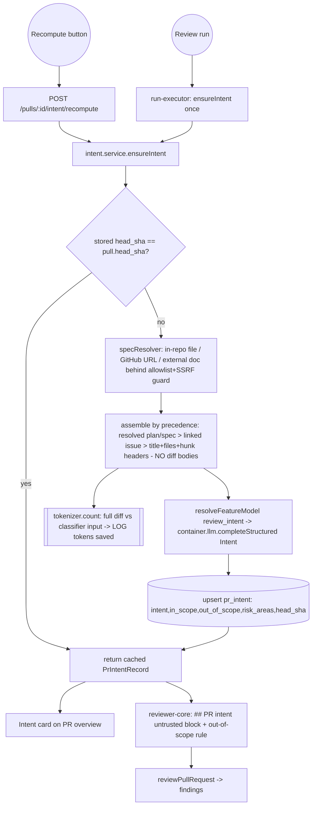

# Plan: Intent Layer

**Status:** Planned · 2026-06-30 · not yet implemented
**Type (Diátaxis):** Explanation + Reference — the Development Plan for the Intent Layer feature, plus the research it was built from, ready to hand to the `implementer` agent (executed sequentially — see §9).
**Scope:** A cheap, flash-class LLM pass that classifies *why* a PR was opened and feeds that intent into the reviewer and the UI. Touches shared contracts, one migration, `reviewer-core`, the server (`modules/intent` + `run-executor`), and the client (PR overview card + settings default).

---

## 1. Goal

Add a separate, **cheap** LLM call (flash-class via OpenRouter) that classifies the motivation behind a pull request and returns a structured `Intent`. The intent is:

- **grounded in any plan/spec the PR points to** — if the PR body contains a plan/spec inline, OR links to one (in-repo file, GitHub issue/PR URL, or external doc), that material is resolved and fed to the classifier as the authoritative source of intent;
- **stored per-PR**, keyed by head SHA;
- **recomputed on demand** via a button (a PR can change, so its intent can change);
- **injected into every reviewer prompt** as *untrusted* content, with the rule "don't comment outside the stated scope; if you spot a serious out-of-scope problem, emit exactly **one** signal finding, not twenty";
- **rendered as an "Intent" card** on the PR overview page (summary quote · In Scope · Out of Scope · Risk Areas · recompute button);
- driven by a **configurable model** in Settings.

The classifier input is deliberately cheap: **PR title + body + resolved plan/spec + linked issue + file list *with hunk headers*, but NO diff bodies.** The token saving vs. sending the full diff is measured and logged.

### Source precedence (how intent is grounded)

When several signals exist, they are labelled and ranked so the model knows what is authoritative:

1. **Explicit plan/spec** — highest. Either inline in the PR body, or resolved from a reference (see below). If present, the model must treat it as *the* statement of intent.
2. **Linked GitHub issue** — `#N` or a full issue/PR URL.
3. **Implicit signals** — PR title + file list + hunk headers. Always available; used alone when nothing above exists (the no-docs degradation path).

A reference to a plan/spec in the body is resolved by a dedicated **spec resolver** (new adapter, Unit 4a) covering three reference kinds:

| Reference kind | Example | How resolved |
|---|---|---|
| **In-repo file** | `docs/plans/intent-layer.md`, or a `github.com/org/repo/blob/<sha>/path` URL into *this* repo | Read from the already-cloned repo via the git adapter — deterministic, no network, no SSRF risk. **Preferred** when the link points into the repo. |
| **GitHub issue/PR URL** | `https://github.com/org/repo/issues/123`, `.../pull/45` | octokit (extends the existing `#N` regex to full URLs). |
| **External doc URL** | Notion, Google Docs, arbitrary web page | HTTP fetch behind a **host allowlist** + SSRF guard (private/link-local/metadata IPs always blocked), size cap, timeout; content wrapped as untrusted. |

All resolved content is capped to a token budget (truncated per source) so the "cheap input" promise holds, and is wrapped with `wrapUntrusted` before reaching the model — a linked spec is data, never an instruction.

### Final `Intent` schema

```ts
Intent = {
  intent: string,            // the one-line summary (existing field — IS the summary)
  in_scope: string[],
  out_of_scope: string[],
  risk_areas: string[],      // NEW — shown in the design mock; added by this plan
}
```

`risk_areas` defaults to `[]` so existing/back-filled rows stay valid. `PrIntentRecord = Intent.extend({ pr_id })` (`review-api.ts:60`) inherits the new field for free.

---

## 2. Why this is mostly *wiring*, not greenfield

A read-only `researcher` pass found the Intent Layer is **~70% already scaffolded** in the course template — most lesson tables/contracts exist empty. What already exists and only needs connecting:

| Already exists | Where |
|---|---|
| `pr_intent` table (`intent`, `in_scope`, `out_of_scope`) | `server/src/db/schema/reviews.ts:48` |
| `Intent` Zod contract + `PrIntentRecord` | `vendor/shared/contracts/brief.ts:9`, `review-api.ts:60` |
| `FeatureModelId.review_intent` + `FEATURE_MODELS` entry | `vendor/shared/contracts/platform.ts:17,57` |
| `resolveFeatureModel(container, ws, 'review_intent')` | `server/src/modules/settings/feature-models.ts:51` |
| Settings UI row (auto-renders per `FEATURE_MODELS` entry) | `client/.../SettingsModels/SettingsModels.tsx` |
| Structured LLM call `completeStructured<T>({model,schema,...})` | `reviewer-core` → `container.llm('openrouter')` |
| `INJECTION_GUARD` already names "derived intent/scope" as untrusted | `reviewer-core/src/prompt.ts` |
| Tokenizer for the savings log | `container.tokenizer.count(text)` |
| Hunk metadata (no patch bodies) `files[].hunks[].{oldStart,…}` | `vendor/shared/adapters.ts:175` |

**Genuine gaps to build:** `risk_areas` + `head_sha` columns (migration), the `intent` prompt slot + out-of-scope rule in `reviewer-core`, the `modules/intent` service/routes/repo, the `run-executor` wiring, token-savings logging, and the client card + hook.

---

## 3. Process

Followed the repo's intended **researcher → planner → implementer** flow. Two read-only `researcher` agents ran in parallel (codebase integration map · current OpenRouter cheap-model shortlist); a `planner` agent then produced the work units below, verifying every cited path.

```mermaid
flowchart TD
  U[User: build "Intent Layer" + put plan in docs/plans] --> R{Research}
  R -->|parallel, read-only| R1[researcher: codebase integration points]
  R -->|parallel, read-only| R2[researcher: OpenRouter cheap models]
  R1 & R2 --> P[planner: Development Plan]
  P --> THIS[(this doc)]
  THIS -.next.-> I[implementer · sequential, dependency-ordered]
```

### Model research outcome (settings default)

- **Default pick:** `google/gemini-2.5-flash-lite` — $0.10/$0.40 per 1M, 1M ctx, native structured output, top of OpenRouter's structured-output reliability benchmark.
- **Runner-up:** `openai/gpt-4o-mini` — $0.15/$0.60, gold-standard `json_schema`, least friction with the existing openai-SDK path.
- **Dropdown shortlist:** `google/gemini-2.5-flash-lite`, `openai/gpt-4o-mini`, `openai/gpt-4.1-mini`, `anthropic/claude-haiku-4.5`, `google/gemini-2.5-flash`, `deepseek/deepseek-v4-flash`.
- **Gotcha baked into the plan:** set `provider: { require_parameters: true }` so OpenRouter only routes to providers that natively enforce `json_schema` (otherwise it may silently fall back to `json_object`). OpenRouter's Response Healing strips code-fences automatically but does **not** fix schema-adherence errors — so keep `parseWithRepair`/`maxRetries` as the real guard.

---

## 4. Architecture & flow

- **Layers touched:** shared contracts (vendored) · migration · `reviewer-core` (pure domain/app) · server delivery+application+infra (`modules/intent`, `modules/reviews/run-executor`, `platform/container`, `modules/index`) · client (hook + overview card + settings registry).
- **Public-contract impact (additive only):** `Intent`/`PrIntentRecord` gain `risk_areas`; `PromptAssembly` gains `intent`; two new routes; an optional `requireParameters?` on `StructuredRequest`. Run `/response-schema` + `/breaking-change`; both should report additive.



### Insights to honor (from the modules' INSIGHTS.md)

- **server** — Drizzle `jsonb('col').$type<string[]>()`: pass the typed value directly, never cast to `object`. `pnpm db:generate` hangs on the rename-prompt under non-TTY → keep migration **add-only** so a single clean 0014 generates. `completeStructured` takes `messages: ChatMessage[]`; annotate the generic explicitly. Cross-module entities hang off the container (`container.intentRepo`).
- **client** — `vendor/shared/contracts` is a byte-copy of the server canonical; edit **both** copies in the same change or types drift. `noUncheckedIndexedAccess` is on → guard indexed access (`arr[0]!` / `?? fallback`).
- **reviewer-core** — keep it PURE (no DB/GitHub/FS); intent arrives as a resolved string on `ReviewInput.intent`, exactly like `prDescription`.

---

## 5. Work units (disjoint file ownership)

### Unit 1 — Shared contracts + feature-model default  ·  *layer: shared*
**Owns (writes only these):**
- `server/src/vendor/shared/contracts/brief.ts` — add `risk_areas: z.array(z.string()).default([])` to `Intent` (after `out_of_scope`; `intent` stays the summary). Propagates to `PrIntentRecord`.
- `server/src/vendor/shared/contracts/trace.ts` — add `intent: z.string().nullish()` to `PromptAssembly` (after `pr_description`).
- `server/src/vendor/shared/contracts/platform.ts` — `review_intent` entry: `defaultProvider → 'openrouter'`, `defaultModel → 'google/gemini-2.5-flash-lite'`.
- `server/src/vendor/shared/adapters.ts` — optional `requireParameters?: boolean` on `StructuredRequest` (JSDoc: "OpenRouter — only route to providers that natively enforce json_schema").
- Mirror all four byte-identically to `client/src/vendor/shared/{contracts/brief.ts,contracts/trace.ts,contracts/platform.ts,adapters.ts}`.
- `client/src/lib/feature-models.ts` — update the `review_intent` default to match (the client can't import the runtime value from vendored shared; this is the **third** sync point).

**Skills:** `zod`, `typescript-expert`, `response-schema`, `breaking-change`, `security`, `engineering-insights`.
**Done when:** `pnpm typecheck` green in `server/` and `client/`; `Intent`/`PrIntentRecord` expose `risk_areas`; `/response-schema` reports additive-only; the two `vendor/shared` copies are identical.

### Unit 2 — Migration 0014: `risk_areas` + `head_sha`  ·  *layer: migration*
**Owns:** `server/src/db/schema/reviews.ts` (the `prIntent` table only) + the generated `server/src/db/migrations/0014_*.sql` (+ drizzle `meta`).
**Steps:** add `riskAreas: jsonb('risk_areas').$type<string[]>().notNull().default(sql\`'[]'::jsonb\`)` and `headSha: text('head_sha')` (nullable = never computed); `pnpm db:generate` (add-only → clean 0014, no rename prompt) → `pnpm db:migrate` (not applied on boot).
**Skills:** `drizzle-orm-patterns`, `postgresql-table-design`, `typescript-expert`, `engineering-insights`.
**Done when:** 0014 applies; both columns present; existing rows stay valid (`[]`, null head_sha).

### Unit 3 — `reviewer-core` intent prompt slot + out-of-scope rule  ·  *layer: reviewer-core*  ·  depends on Unit 1
**Owns:** `reviewer-core/src/prompt.ts`, `reviewer-core/src/review/run.ts`, `reviewer-core/src/llm/openrouter.ts`, `reviewer-core/test/prompt.test.ts`, `reviewer-core/test/run.test.ts`.
**Steps:**
1. `prompt.ts`: add `intent?: string` to `PromptParts` (after `prDescription`). Render a `## PR intent` section after `## PR description`: a **trusted** lead-in — *"Treat the block below as the PR's stated intent. Don't comment outside the stated scope; if you spot a serious problem out of scope, emit exactly ONE signal finding, not many."* — then `wrapUntrusted('intent', parts.intent)`. Set `assembly.intent = parts.intent ?? null`. (INJECTION_GUARD still overrides; the rule narrows commentary, never waives a real defect.)
2. `review/run.ts`: add `intent?: string` to `ReviewInput`; thread into `promptParts`.
3. `llm/openrouter.ts`: when `req.requireParameters` and provider is openrouter, spread `provider: { require_parameters: true }`. Keep `parseWithRepair`/`maxRetries`.
4. Tests: intent block present/omitted, out-of-scope rule text, untrusted wrapping, `assembly.intent` (stubbed `LLMProvider`).

**Skills:** `onion-architecture` (stay pure), `typescript-expert`, `zod`, `security`, `engineering-insights`.
**Done when:** `pnpm test` + `pnpm typecheck` green in `reviewer-core/`; **intent omitted ⇒ prompt byte-identical to today.**

### Unit 4a — Spec/Plan resolver adapter  ·  *layer: backend/infra*  ·  depends on nothing new (uses existing git + github adapters)
Resolves a plan/spec referenced by a PR into untrusted text for the classifier. New, isolated adapter so SSRF/allowlist controls live in one place and the whole thing is mockable.
**Owns:**
- `server/src/adapters/specfetch/index.ts` — port `SpecResolver` + types `SpecReference`, `ResolvedSpec` (`{ kind, ref, text, truncated }`).
- `server/src/adapters/specfetch/extract-references.ts` — parse a PR body into `SpecReference[]`: inline plan/spec blocks, in-repo file paths, GitHub blob/issue/PR URLs, and external URLs (classified by host).
- `server/src/adapters/specfetch/git-source.ts` — read in-repo files from the cloned repo at the PR head SHA via the existing git adapter (no network).
- `server/src/adapters/specfetch/github-source.ts` — issues/PRs via octokit, extending the existing `closes/fixes #N` regex to full `github.com/.../issues|pull/N` URLs.
- `server/src/adapters/specfetch/web-source.ts` — external fetch with: **host allowlist**; hard block of private / loopback / link-local / cloud-metadata IPs (e.g. `169.254.169.254`) regardless of allowlist; redirect re-validation; `Content-Type`/size cap; timeout; text-only extraction.
- `server/src/platform/config.ts` — add `intentSpecAllowlist: string[]` (env-driven; default = common public doc hosts: `github.com`, `raw.githubusercontent.com`, `gist.github.com`, `*.notion.so`, `docs.google.com`) and `intentSpecMaxTokens` budget. *(This is the single owner of `config.ts` for this feature.)*
- `server/src/adapters/specfetch/specfetch.test.ts` — hermetic: reference extraction; git-source reads a repo file; web-source **rejects** a private-IP/non-allowlisted host and accepts an allowlisted one (HTTP mocked); per-source truncation to budget.

**Steps:** `resolve(prBody, repoRef, headSha): Promise<ResolvedSpec[]>` — extract references, dispatch each to the matching source, prefer git-source when a GitHub URL points into the repo, swallow per-source failures (best-effort), truncate to the token budget, return labelled results. All text returned raw (the service wraps it untrusted).
**Skills:** `onion-architecture`, `security` (SSRF/OWASP — central to this unit), `typescript-expert`, `zod`, `fastify-best-practices`, `engineering-insights`.
**Done when:** in-repo paths resolve from the clone; full GitHub issue/PR URLs resolve via octokit; external fetch honours the allowlist and **blocks** private/metadata IPs; oversized docs truncate; all failures degrade silently; unit tests + `pnpm typecheck` green.
**Out of scope:** the intent service, container wiring (Unit 4 owns `container.ts`/`mocks.ts`), persistence.

### Unit 4 — Backend `intent` module (routes + service + repository)  ·  *layer: backend*  ·  depends on Units 1, 2 & 4a
**Owns:** `server/src/modules/intent/{routes.ts,service.ts,repository.ts,constants.ts,service.test.ts}` + (single owner) `server/src/modules/index.ts` (register `intent`), `server/src/platform/container.ts` (lazy `get intentRepo` **and** `get specResolver()` wiring Unit 4a's adapter + its `ContainerOverrides` entry), and `server/src/adapters/mocks.ts` (a `MockSpecResolver` for tests).
**Steps:**
1. `repository.ts` (infra): `getByPrId(prId) → row|null`; `upsert({prId,intent,inScope,outOfScope,riskAreas,headSha})` via Drizzle `onConflictDoUpdate` on `prId` (pass typed `string[]` directly — no `object` cast).
2. `constants.ts`: `INTENT_SYSTEM` prompt with **source precedence + no-docs degradation baked in** — the model is told: a resolved plan/spec (if present) is the authoritative statement of intent; a linked issue is next; if none exist, infer best-effort intent from title + file list + hunk headers and never fail. Require `risk_areas` in the output.
3. `service.ts` (application) `ensureIntent(workspaceId, prId)`:
   - load pull row (title, body, headSha); load file list + hunk headers via `modules/reviews/diff-loader.ts` (`loadDiff`, do not edit it), synthesize `@@ -oldStart,oldLines +newStart,newLines @@` from `UnifiedDiff.files[].hunks` — **no patch bodies**;
   - **cache:** stored row with `head_sha === pull.headSha` → return it, no LLM call;
   - **resolve plan/spec:** `container.specResolver.resolve(pull.body, repoRef, pull.headSha)` → labelled `ResolvedSpec[]`; best-effort linked issue from `PrDetail.linked_issue` (octokit `getPullRequest`); both skipped silently if unavailable;
   - **assemble classifier input by precedence:** resolved plan/spec (authoritative) → linked issue → title + file list + hunk headers; each section labelled and `wrapUntrusted`-wrapped, total capped to the spec token budget;
   - **token-savings log:** `tokenizer.count(diff.raw)` vs `count(classifierInput)`, log the saved delta;
   - `resolveFeatureModel(container, ws, 'review_intent')` → `container.llm(provider).completeStructured<Intent>({ model, schema: Intent, schemaName: 'Intent', messages, maxRetries, ...(provider==='openrouter' ? { requireParameters: true } : {}) })`;
   - persist (store `headSha`); return `PrIntentRecord`.
4. `routes.ts` (delivery): `GET /pulls/:id/intent` → `PrIntentRecord | null`; `POST /pulls/:id/intent/recompute` → calls `ensureIntent`, returns `PrIntentRecord`. Declare Zod response schemas; 422 handles bad params.
5. Register `intent` in `modules/index.ts`; add `container.intentRepo`.
6. `service.test.ts` (hermetic, MockLLMProvider via `ContainerOverrides`): no-docs degradation yields a valid Intent; head-SHA cache short-circuits the LLM; `risk_areas` persists.

**Skills:** `onion-architecture`, `fastify-best-practices`, `drizzle-orm-patterns`, `zod`, `security`, `typescript-expert`, `engineering-insights`.
**Done when:** `GET` returns stored intent or `null`; `POST recompute` calls the cheap model once, logs tokens saved, is an LLM no-op on an unchanged head SHA, persists `risk_areas` + `head_sha`; unit tests + `pnpm typecheck` green; `/breaking-change` reports the two routes additive.

### Unit 5 — Inject intent into the review run  ·  *layer: backend*  ·  depends on Units 3 & 4
**Owns:** `server/src/modules/reviews/run-executor.ts` only + new `server/src/modules/reviews/run-executor.it.test.ts`.
**Steps:**
1. Between diff-ready (~line 106) and the per-agent loop (~line 108), call `ensureIntent` **once** wrapped in `runLog.step('Deriving PR intent', …)` so it lands in every fanned-out run's buffer (matches the existing "Loads the diff + intent once" comment). Failure is **non-fatal** — log and continue without intent.
2. Pass the resolved `intent` string into `reviewPullRequest({ …, ...(intent ? { intent } : {}) })` (~line 205), like `prDescription`; `assembly.intent` then flows into the persisted `RunTrace`.
3. `.it.test.ts` (DB-backed, self-skips without Docker, MockLLMProvider override): a run on a PR with intent injects the `## PR intent` block and populates `prompt_assembly.intent`.

**Skills:** `onion-architecture`, `fastify-best-practices`, `typescript-expert`, `security`, `engineering-insights`.
**Done when:** a run derives intent once and injects it into all agents; trace `prompt_assembly.intent` populated; **intent omitted ⇒ prompt identical to pre-feature**; integration test passes or self-skips.

### Unit 6 — Client: Intent card + hook  ·  *layer: ui*  ·  depends on Unit 1 mirror + Unit 4 routes
**Owns:** `client/src/hooks/intent.ts` (new); `client/src/app/repos/[repoId]/pulls/[number]/_components/IntentCard/{IntentCard.tsx,index.ts,styles.ts,IntentCard.test.tsx}`; `client/src/app/repos/[repoId]/pulls/[number]/_components/OverviewTab/OverviewTab.tsx`; the i18n file the card uses (e.g. `client/messages/en/prReview.json`).
**Steps:**
1. `hooks/intent.ts`: `usePrIntent(prId)` → `api.get<PrIntentRecord | null>(\`/pulls/${prId}/intent\`)` (mirror `usePullDetail` in `client/src/hooks/core.ts`); `useRecomputeIntent(prId)` → `api.post(\`/pulls/${prId}/intent/recompute\`)` invalidating the intent query. Import via `@/hooks/intent` (no barrel edit — `conventions.ts` is imported directly too).
2. `IntentCard`: presentational — summary quote (`intent`), ✓ **In Scope**, ✕ **Out of Scope**, **Risk Areas** (`risk_areas`), recompute button wired to `useRecomputeIntent`. Container handles loading/empty/error; `aria-label` on the icon-only button; `aria-live="polite"` on the result region; guard indexed access.
3. `OverviewTab`: accept `prId`, render `<IntentCard prId={prId} />` above the description block (keep the page thin).
4. `IntentCard.test.tsx` (mock `fetch`): loads & renders all four sections; empty (`null`) state; recompute click → POST + refetch.

**Skills:** `frontend-architecture`, `react-best-practices`, `next-best-practices`, `react-testing-library`, `typescript-expert`, `zod`, `engineering-insights`.
**Done when:** card shows summary + In/Out scope + Risk Areas + working recompute; `pnpm typecheck` + `pnpm test` green; the Settings `review_intent` picker (auto from the registry) shows the new default.

### Cross-cutting / shared files (single-owner)
- **Vendored shared contracts** — canonical in `server/src/vendor/shared/**`, mirrored to `client/src/vendor/shared/**` + `client/src/lib/feature-models.ts`: **Unit 1 only**, runs first.
- **`server/src/modules/index.ts`** + **`server/src/platform/container.ts`** — **Unit 4 only**.
- **`server/src/modules/reviews/run-executor.ts`** — hot file, **Unit 5 only**.

---

## 6. Execution order

Executed **serially, one unit at a time** (see §9). The "waves" are dependency boundaries — a later wave may not start until the earlier one is in and green — not parallel groups. Recommended order: **1 → 2 → 4a → 3 → 4 → 5 → 6.**

| Wave (dependency boundary) | Units (run in sequence) | Gates unlocked |
|---|---|---|
| **Wave 1** | Unit 1 (contracts) → Unit 2 (migration) → Unit 4a (spec resolver) | `Intent.risk_areas`, `PromptAssembly.intent`, `pr_intent.head_sha`, `SpecResolver` |
| **Wave 2** | Unit 3 (reviewer-core slot) → Unit 4 (backend module — needs U1, U2, U4a) | prompt `intent?` slot; intent service + routes |
| **Wave 3** | Unit 5 (run-executor wiring) → Unit 6 (client card) | intent in live reviews; UI card + recompute |

*(If parallelism is ever wanted again, pass `isolation: "worktree"` per `implementer` call and commit between waves — but the default flow is serial.)*

---

## 7. Test plan

- **Unit (hermetic):** reviewer-core `prompt.test.ts`/`run.test.ts` (render/omit, out-of-scope rule, `assembly.intent`); server `adapters/specfetch/specfetch.test.ts` (reference extraction; in-repo file read; **SSRF guard rejects private-IP/non-allowlisted host, accepts allowlisted**; truncation to budget; HTTP mocked); server `modules/intent/service.test.ts` (source precedence — resolved spec wins; no-docs degradation; head-SHA cache short-circuit; token-savings log; `risk_areas` persisted; MockLLMProvider + MockSpecResolver via `ContainerOverrides`); client `IntentCard.test.tsx` (load/empty/recompute, `fetch` mocked).
- **Integration (`*.it.test.ts`, DB-backed, self-skips without Docker):** `modules/reviews/run-executor.it.test.ts` — intent injected into prompt + surfaced in the persisted trace.
- **Commands:** server unit `pnpm exec vitest run --exclude '**/*.it.test.ts'`; server integration `pnpm exec vitest run .it.test`; `pnpm test` in `reviewer-core/` and `client/`; `pnpm typecheck` in all three.

### End-to-end verification
1. `pnpm db:migrate` (apply 0014) → `./scripts/dev.sh` smoke (Postgres + API :3001 + web :3000).
2. Settings → Feature Models: "PR Review · Intent" picker defaults to `google/gemini-2.5-flash-lite`; change persists.
3. PR overview: Intent card renders summary + In/Out scope + Risk Areas; Recompute → POST fires, server log shows the tokens-saved delta; a second click on the unchanged head SHA makes **no** LLM call (cache hit).
4. Run a review: trace `prompt_assembly.intent` populated, the `## PR intent` block (with the one-signal-finding rule) present in the prompt.
5. Contract gates: `/breaking-change` + `/response-schema` report **additive only**; the two `vendor/shared` copies are byte-identical.

---

## 8. Risks / out of scope

- **Spec/plan resolution is now in scope** (Unit 4a) for three reference kinds: in-repo files, GitHub issue/PR URLs, and external doc URLs. **Security:** the external fetch is the one new attack surface — it MUST run behind a host allowlist, MUST block private/loopback/link-local/cloud-metadata IPs (incl. redirect re-validation) regardless of allowlist, and MUST cap size + timeout. All resolved content is untrusted and wrapped before reaching any model.
- **External-doc cache caveat:** intent is cached by `head_sha`, but a linked external doc can change without the head SHA changing — so an edited Notion/Docs page won't auto-refresh the intent; the **Recompute** button forces a re-fetch. (Acceptable; documented.)
- **Token budget:** resolved spec content is truncated to a per-source / total budget so the "cheap input" promise holds even when a linked plan is large.
- **Out of scope:** persisting `linked_issue` / resolved spec to the DB; rendering with full Markdown of external docs; the **Blast Radius** panel (a separate feature); any change to the grounding gate or finding-scoring.
- **`require_parameters`** is opt-in, so the existing review path is untouched; `parseWithRepair` + `maxRetries` remain the real schema-adherence guard.
- **`risk_areas`** is the one genuine schema change; defaulting to `[]` keeps existing `pr_intent` rows and the LLM contract valid. *(This field is shown in the design mock but was absent from the original text spec — added here deliberately to match the design.)*
- **Graceful degradation** is a first-class requirement: a PR with no issue/spec/docs must still yield a best-effort intent from title + file list + hunk headers; the run-executor treats an intent failure as non-fatal.
- **Settings UI `setModel`** always writes `provider: "openrouter"`, so the openrouter default aligns with how user overrides persist.

---

## 9. Execution notes (for implementers) — kickoff

How to drive this plan with the `implementer` agent in the current setup:

- **Work in the MAIN working tree — no worktree isolation.** The `implementer` agent no longer declares `isolation: worktree`. Because every unit edits the same tree, run implementers **sequentially — one unit at a time**, never two concurrently (they would see each other's half-written files and race on the git index / typecheck). Disjoint file ownership still matters, but it no longer gives parallel safety on its own.
- **Order:** follow the waves as a sequence — Unit 1 → Unit 2 → Unit 4a → Unit 3 → Unit 4 → Unit 5 → Unit 6. (Waves only mark dependency boundaries now; execution is serial.) After each unit, run the relevant `pnpm typecheck` and confirm green before starting the next.
- **Tests are DEFERRED.** Do **not** write new test files during this pass (ignore the `*.test.ts` / `*.it.test.ts` deliverables and the test-related "Done when" lines for now). Still keep any *existing* tests + `pnpm typecheck` green. Test coverage is a later, separate pass (e.g. via `test-writer`).
- **Migration timing:** after Unit 2 generates `0014_*.sql`, run `pnpm db:migrate` **before** any code that reads `risk_areas` / `head_sha` is executed (i.e. before exercising Unit 4/5 at runtime). This is about apply-order, not git.
- **Commits:** a single commit at the end of the feature is sufficient — intermediate per-unit/per-wave commits are **optional** checkpoints only (the old "commit between waves" requirement is gone now that there are no worktrees to branch from).
- **Finish with review:** once all units are in and `pnpm typecheck` is green across `server/`, `client/`, and `reviewer-core/`, run the read-only `architecture-reviewer` and `plan-verifier` agents over the result; address any CRITICAL findings before opening a PR.

<!-- Built via researcher → planner. Researcher reports: codebase integration map + OpenRouter cheap-model shortlist (2026-06-30). Planner verified every cited path before emitting work units. No application code was written by this plan; it is the hand-off artifact for the implementer agent (see §9 for execution mechanics). -->
